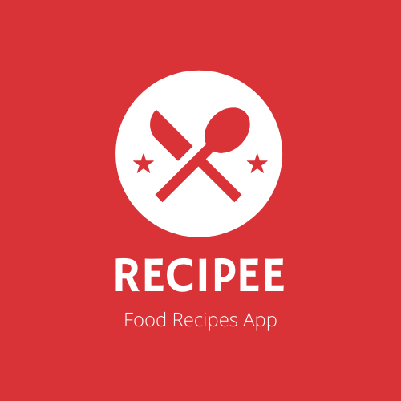

<h1 align="center">
   
  </a>
   
  Recipee
   
</h1>

<h4 align="center">Find recipes that fit your needs.</h4>

  <a href="#getting-started">Getting Started</a> •
  <a href="#credits">Credits</a> 

## Getting Started

This project is a starting point for a Flutter application.

A few resources to get you started if this is your first Flutter project:

- [Lab: Write your first Flutter app](https://flutter.dev/docs/get-started/codelab)
- [Cookbook: Useful Flutter samples](https://flutter.dev/docs/cookbook)

For help getting started with Flutter, view our
[online documentation](https://flutter.dev/docs), which offers tutorials,
samples, guidance on mobile development, and a full API reference.

## Credits

This project uses the following open source packages:

- [TheMealDB]([http://electron.atom.io/](https://themealdb.com/))
- Illustration are taken from [unDraw](https://undraw.co/illustrations)
- Logo made with [Canva](https://www.canva.com/)
